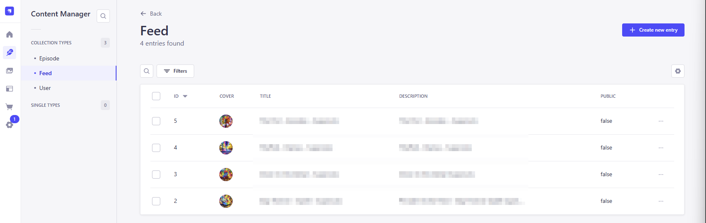
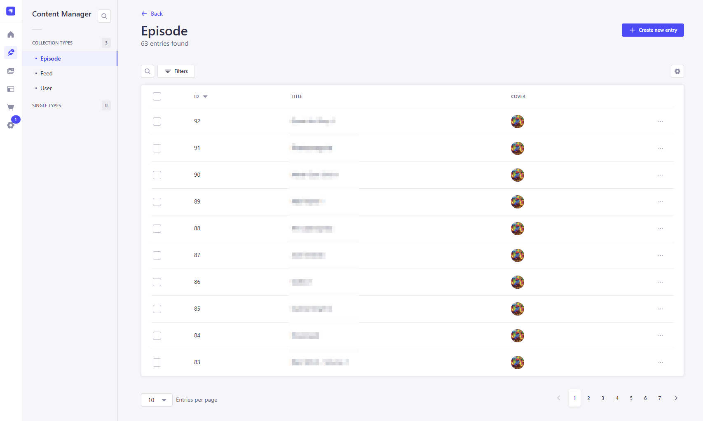
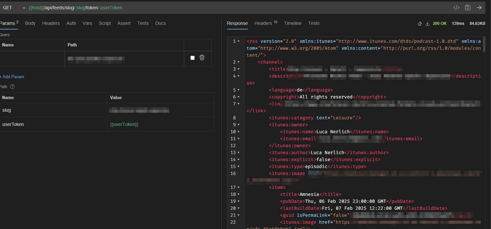
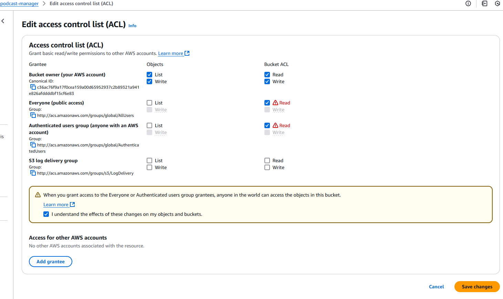
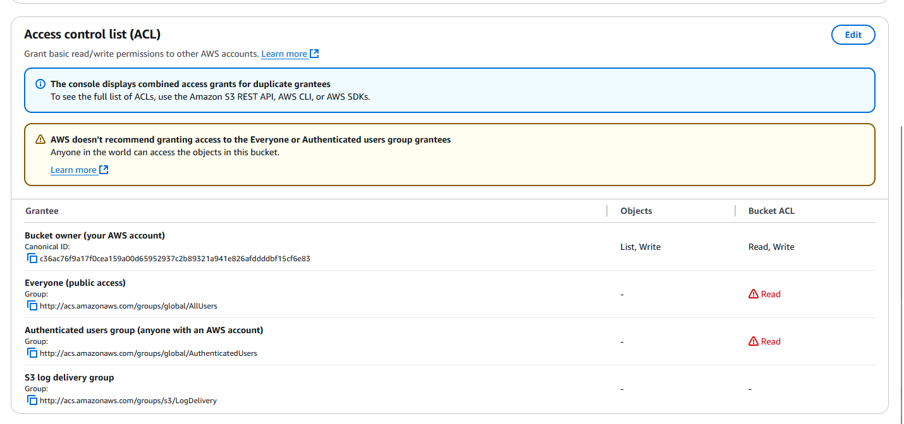

# Podcast Feed Manager

A headless CMS solution built with Strapi for managing RSS podcast feeds, including episodes, MP3 files, covers, and
private access controls.



[🇩🇪 A post about this](https://m10z.de/podcast-manager-strapi-cms)

## Features

- **Podcast Management:** Create, update, and delete podcast feeds.
- **Episode Management:** Add, edit, and organize episodes with MP3 file uploads.
- **Media Management:** Built-in file handling for MP3 and image files.
  - **Cover Art Handling:** Easily upload and manage cover images for your podcasts.
- **Private Podcasts:** Restrict access to specific users or user groups.
- **User Authentication:** Secure user authentication system for managing private content.
- **API Integration:** Expose endpoints for easy integration with any frontend application.





## Endpoints

Private Feeds

- {{host}}/api/feeds/slug/:slug/token/:token
- {{host}}/api/feeds/documentId/:documentId/token/:token

Public Feeds

- {{host}}/api/feeds/slug/:slug
- {{host}}/api/feeds/documentId/:documentId
- {{host}}/api/feeds/public

User Management

> Authorization: Bearer {{jwt}}

- {{host}}/api/auth/local/register
    ```json
    {
    "email": "user@mail.com",
    "username": "user@mail.com",
    "password": "some-password"
    }
    ```
- {{host}}/api/users/me
  - Read Self
- {{host}}/api/auth/local
  - Login
    ```json
    {
    "identifier": "user@mail.com",
    "password": "some-password"
    }
    ```
- {{host}}/api/users/{{userId}}/newToken
  - Generate a new token for yourself

## Database Setup

Podcast Manager uses Postgres

1. `CREATE DATABASE podcastmanager;`
2. `CREATE ROLE podcastmanager_user WITH LOGIN PASSWORD 'changeme' CREATEDB;`
3. `\du` -> display info
4. `GRANT ALL PRIVILEGES ON DATABASE podcastmanager TO podcastmanager_user;`
5. `ALTER USER podcastmanager_user WITH SUPERUSER;`

## AWS S3

Podcast Manager saves uploaded MP3 files and Cover Images to AWS S3 via Strapi S3 Plugin.

### Bucket ACL





### Bucket Policy

```json
{
    "Version": "2008-10-17",
    "Statement": [
        {
            "Sid": "AllowPublicRead",
            "Effect": "Allow",
            "Principal": {
                "AWS": "*"
            },
            "Action": "s3:GetObject",
            "Resource": "arn:aws:s3:::podcast-manager/*"
        }
    ]
}
```

Bucket CORS

```json
[
    {
        "AllowedHeaders": [
            "*"
        ],
        "AllowedMethods": [
            "GET"
        ],
        "AllowedOrigins": [
            "http://localhost:1337",
            "127.0.0.1",
            "https://podcastmanager.lucanerlich.com"
        ],
        "ExposeHeaders": []
    }
]
```

## Postgres Setup

1. `sudo su - postgres` || `psql -U postgres`
2. `CREATE DATABASE podcastmanager;`
3. `CREATE ROLE podcastmanager_user WITH LOGIN PASSWORD 'changeme' CREATEDB;`
4. `\du` -> display info
5. `GRANT ALL PRIVILEGES ON DATABASE podcastmanager TO podcastmanager_user;`
6. `ALTER USER podcastmanager_user WITH SUPERUSER;`
    or alternatively: 
    1. `\c podcastmanager`
    2. `GRANT ALL PRIVILEGES ON DATABASE podcastmanager TO podcastmanager_user;`
    - "[...] permission denied for schema public [...]"
7. `\l` -> display info
8. If superuser is needed, e.g for migration
    1. `ALTER USER podcastmanager_user WITH SUPERUSER;`